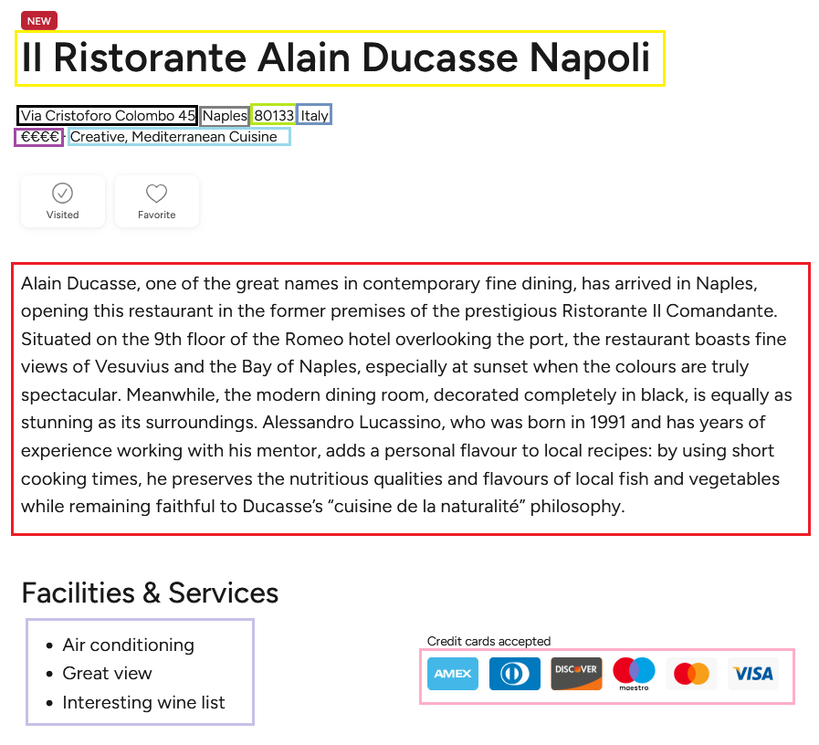
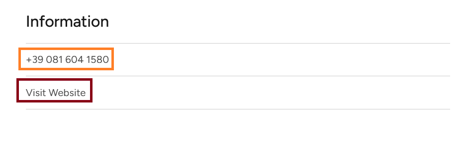
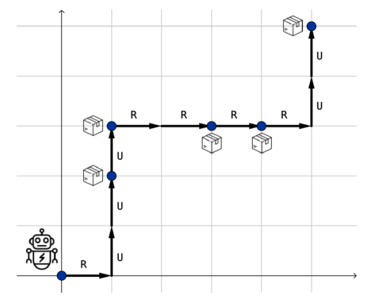

# Homework 3 - Michelin restaurants in Italy
)
In today's world, people are more eager than ever to discover culinary experiences that are both unique and unforgettable. The culinary arts have transformed from a mere necessity into a refined skill, with passionate chefs pushing the boundaries of creativity and flavor. For food enthusiasts, travelers, and students of gastronomy alike, resources like the Michelin Guide are invaluable. This platform, accessible through the [Michelin Guide website](https://guide.michelin.com/en/it/restaurants), provides information, reviews, and ratings for restaurants across Italy and beyond, recognized for their quality, innovation, and exceptional dining experiences. 

You and your team have been hired to build a search engine tailored for food enthusiasts, helping users discover and rank Michelin-starred restaurants across Italy based on their unique preferences. Your mission: create an efficient, user-friendly tool for exploring Italy’s finest dining experiences.

## VERY VERY IMPORTANT
1. **!!! Read the entire homework before coding anything!!!**
2. *My solution is not better than yours, and yours is not better than mine*. In any data analysis task, there **is no** unique way to answer. For this reason, it is crucial (**necessary and mandatory**) that you describe any single decision you take and all your steps.
3. Once solving an exercise, comments about the obtained results are **mandatory**. We are not always explicit about where to focus your comments, but we will always want brief sentences about your discoveries.
4. We encourage using chatGPT (Claude AI, Gemini, Perplexity, or any other Large Language Models (LLM) chatbot tool) as allies to help you solve your homework, and we were hoping you could learn how to use them properly. However, **using such tools when not explicitly allowed will be considered plagiarism and strictly prohibited**. 

Now that it is all well settled let's get on with it!

## 1. Data collection

For this homework, no dataset has been provided. Instead, you have to build your own. Your search engine will run on text documents. So, here
we detail the procedure to follow for the data collection. We strongly suggest you work on different modules when implementing the required functions. For example, you may have a ```crawler.py``` module, a ```parser.py``` module, and a ```engine.py``` module: this is a good practice that improves readability in reporting and efficiency in deploying the code. Be careful; you are likely dealing with exceptions and other possible issues! 


### 1.1. Get the list of Michelin restaurants

You should begin by compiling a list of restaurants to include in your document corpus. Specifically, you will focus on web scraping the [Michelin Restaurants in Italy](https://guide.michelin.com/en/it/restaurants). Your task is to **collect the URL** associated with each restaurant in this list. The output of this step should be a `.txt` file where each line contains a single restaurant’s URL. By the end, you should have approximately 2,037 restaurants on your list.

### 1.2. Crawl Michelin restaurant pages

Once you have all the URLs on the list, you should:

1. Download the HTML corresponding to each of the collected URLs.
2. After collecting each page, immediately save its `HTML` in a file. This way, if your program stops for any reason, you will not lose the data collected up to the stopping point.
3. Organize the downloaded `HTML` pages into folders. Each folder will contain the `HTML` of the restaurants from page 1, page 2, ... of the Michelin restaurant list.

__Tip__: Due to the large number of pages to download, consider using methods that can help shorten the process. If you employed a particular process or approach, kindly describe it.

### 1.3 Parse downloaded pages

At this point, you should have all the HTML documents about the restaurant of interest, and you can start to extract specific information. The list of the information we desire for each restaurant and their format is as follows:

1. **Restaurant Name** (to save as `restaurantName`): string;
2. **Address** (to save as `address`): string;
3. **City** (to save as `city`): string;
4. **Postal Code** (to save as `postalCode`): string;
5. **Country** (to save as `country`): string;
6. **Price Range** (to save as `priceRange`): string;
7. **Cuisine Type** (to save as `cuisineType`): string;
8. **Description** (to save as `description`): string;
9. **Facilities and Services** (to save as `facilitiesServices`): list of strings;
10. **Accepted Credit Cards** (to save as `creditCards`): list of strings;
11. **Phone Number** (to save as `phoneNumber`): string;
12. **URL to the Restaurant Page** (to save as `website`): string.

<p align="center">

</p>
<p align="center">

</p>
This is the first few rows of the scraped dataset:

<div style="overflow-x:auto;">
<table>
<thead>
  <tr>
    <th>index</th>
    <th>restaurantName</th>
    <th>address</th>
    <th>city</th>
    <th>postalCode</th>
    <th>country</th>
    <th>priceRange</th>
    <th>cuisineType</th>
    <th>description</th>
    <th>facilitiesServices</th>
    <th>creditCards</th>
    <th>phoneNumber</th>
    <th>website</th>
  </tr>
</thead>
<tbody>
  <tr>
    <td>0</td>
    <td>Abbruzzino Oltre</td>
    <td>Piazza Salvo d'Acquisto 16</td>
    <td>Lamezia Terme</td>
    <td>88046</td>
    <td>Italy</td>
    <td>€€€€</td>
    <td>Contemporary, Mediterranean Cuisine</td>
    <td>This restaurant, the new home of young chef Luca Abbruzzino, occupies the first floor of a historic palazzo...</td>
    <td>['Air conditioning']</td>
    <td>['Amex', 'Mastercard', 'Visa']</td>
    <td>+39 0968 188 8038</td>
    <td>http://www.abbruzzinoltre.it</td>
  </tr>
  <tr>
    <td>1</td>
    <td>Gallo Nero</td>
    <td>Via del Porrione 65/67</td>
    <td>Sienna</td>
    <td>53100</td>
    <td>Italy</td>
    <td>€€€</td>
    <td>Regional Cuisine, Contemporary</td>
    <td>Situated on the edge of the Leocorno contrada in Siena, Gallo Nero offers a traditional, rustic atmosphere...</td>
    <td>['Air conditioning', 'Terrace']</td>
    <td>[]</td>
    <td>+39 0577 284356</td>
    <td>https://www.ristorantegallonero.it/</td>
  </tr>
  <tr>
    <td>2</td>
    <td>La Locanda di Fabio e Vale</td>
    <td>via Brescia 1</td>
    <td>Offanengo</td>
    <td>26010</td>
    <td>Italy</td>
    <td>€€</td>
    <td>Modern Cuisine, Creative</td>
    <td>Young, informal and friendly owners Fabio and Vale bring a refreshing touch to the dining experience...</td>
    <td>['Air conditioning', 'Terrace']</td>
    <td>['Mastercard', 'Visa']</td>
    <td>+39 346 148 3963</td>
    <td>http://www.lalocandadifabioevale.it</td>
  </tr>
  <tr>
    <td>3</td>
    <td>Donevandro</td>
    <td>via Garibaldi 2</td>
    <td>Popoli</td>
    <td>65026</td>
    <td>Italy</td>
    <td>€€</td>
    <td>Contemporary, Seasonal Cuisine</td>
    <td>Up until a few years ago, the owner-chef at this contemporary establishment worked in several renowned kitchens...</td>
    <td>['Air conditioning']</td>
    <td>['Mastercard', 'Visa']</td>
    <td>+39 388 887 6858</td>
    <td>http://www.donevandroristorante.it</td>
  </tr>
  <tr>
    <td>4</td>
    <td>Masseria Moroseta</td>
    <td>Contrada Lamacavallo</td>
    <td>Ostuni</td>
    <td>72017</td>
    <td>Italy</td>
    <td>€€€€</td>
    <td>Mediterranean Cuisine, Modern Cuisine</td>
    <td>Chef Giorgia Eugenia Goggi offers a unique and refined interpretation of Apulian cuisine at Masseria Moroseta...</td>
    <td>['Car park', 'Terrace']</td>
    <td>['Amex', 'Mastercard', 'Visa']</td>
    <td>+39 376 079 8288</td>
    <td>https://www.masseriamoroseta.it</td>
  </tr>
</tbody>
</table>
</div>

For each restaurant, you create a `restaurant_i.tsv` file of this structure:

```
restaurantName \t address \t  ... \t url
```

If an information is missing, you just leave it as an empty string.

## 2. Search Engine

This search engine allows you to retrieve restaurants based on a user query. We’ll build two types of search engines:

1. **Conjunctive Search Engine**: Returns restaurants where all query terms appear in the description.
2. **Ranked Search Engine**: Returns the top-*k* restaurants sorted by similarity to the query, using **TF-IDF** and **Cosine Similarity**.

### 2.0 Preprocessing 

### 2.0.0) Preprocessing the Text

Before building the search engine, you must clean and prepare the text in each restaurant’s description. We will:
1. Remove stopwords.
2. Remove punctuation.
3. Apply stemming.
4. Perform any other necessary cleaning to improve search accuracy.

For this, we use the [`nltk library`](https://www.nltk.org/).

### 2.1 Conjunctive Query

This first version of the search engine narrows the search to the **description** field of each restaurant. Only restaurants whose descriptions contain all the query words will be returned.

#### 2.1.1 Create Your Index!

1. **Vocabulary File**: Create a file called `vocabulary.csv` that maps each word to a unique integer (`term_id`).
2. **Inverted Index**: Build a dictionary mapping each `term_id` to a list of document IDs where that term appears.

```json
{
  "term_id_1": [document_1, document_2, document_4],
  "term_id_2": [document_1, document_3, document_5],
  ...
}
```

Each `document_i` represents a unique restaurant.

__Hint__: Store the inverted index in a separate file to avoid recomputation.

#### 2.1.2 Execute the Query

When the user inputs a query, for example, `"modern seasonal cuisine"`, the search engine will:
1. Process the query terms.
2. Find and return a list of restaurants containing **all** query words in their description.

The output should include:
- `restaurantName`
- `address`
- `description`
- `website`

__Example Output__ for `"modern seasonal cuisine"`:

| Restaurant Name         | Address                         | Description                                      | Website                         |
|-------------------------|---------------------------------|--------------------------------------------------|---------------------------------|
| Le Vie del Borgo        | via alla Piazza 6              | Le Vie del Borgo is situated in a restored rus...| http://leviedelborgoguesthouse.it/ |
| Babette                 | via Michelangelo 17            | Situated just beyond the centre of Albenga in... | https://www.ristorantebabette.net/ |
| Savô                    | piazza XXV Aprile 8            | The reopening in 2022 of the Hotel Windsor wit...| http://www.thewindsor.it        |
| Pipero Roma             | corso Vittorio Emanuele II 250 | Situated opposite the church of Santa Maria in...| https://www.piperoroma.it       |
| Retrobottega            | via della Stelletta 4          | Minimalist decor and clean lines characterise ...| https://www.retro-bottega.com   |

If this works as expected, proceed to build the ranked search engine.

### 2.2 Ranked Search Engine with TF-IDF and Cosine Similarity

For the second search engine, given a query, retrieve the *top-k* restaurants ranked by relevance to the query.

#### 2.2.1 Inverted Index with TF-IDF Scores
1. **tfIdf Scores**: Calculate TF-IDF scores for each term in each restaurant’s description.
2. **Updated Inverted Index**: Build a new inverted index where each entry is a term, and the value is a list of tuples containing document IDs and TF-IDF scores.

Example format:
```json
{
  "term_id_1": [(document1, tfIdf_{term,document1}), (document2, tfIdf_{term,document2}), ...],
  "term_id_2": [(document1, tfIdf_{term,document1}), (document3, tfIdf_{term,document3}), ...],
  ...
}
```

#### 2.2.2 Execute the Ranked Query

For the ranked search engine:
1. Process the query terms.
2. Use **Cosine Similarity** to rank matching restaurants based on the TF-IDF vectors of the query and each document.
3. Return the *top-k* results or all matching restaurants if fewer than *k* have non-zero similarity.

Each result should include:
- `restaurantName`
- `address`
- `description`
- `website`
- Similarity score (between 0 and 1)

__Example Output__ for `"modern seasonal cuisine"`:

| Restaurant Name                  | Address                         | Description                                      | Website                         | Similarity Score |
|----------------------------------|---------------------------------|--------------------------------------------------|---------------------------------|------------------|
| Al Camin                         | località Alverà 99              | On the road to Misurina lake, this friendly re...| https://www.ristorantealcamin.it/ | 0.9999           |
| La Piemontese                    | via San Martino 48              | The focus at La Piemontese, a simple yet moder...| http://www.lapiemontesemariano.it | 0.9479           |
| Osteria Taviani                  | piazza Vittorio Emanuele II 28  | This pleasant, warmly decorated restaurant is ...| NaN                             | 0.9479           |
| Ventuno.1                        | via Cuneo 8                     | Closed for renovations until April 2024.Two na...| https://ventunopuntouno.it/     | 0.9479           |
| La Musa Restaurant & Rooftop ... | Località Cini 29                | Just six intimate tables in a modern restauran...| https://ristorante-la-musa.com  | 0.9479           |


The above tables show the sorted output by cosine similarity scores.

## 3. Define a New Score!

Now, we will define a custom ranking metric to prioritize restaurants based on user queries.

### Steps:

1. **User Query**: The user provides a text query. We’ll retrieve relevant documents using the search engine built in Step 2.1.
2. **New Ranking Metric**: After retrieving relevant documents, we’ll rank them using a new custom score. Instead of limiting the scoring to only the `description` field, we can include other attributes like `priceRange`, `facilitiesServices`, and `cuisineType`.
3. You will use a **heap data structure** (e.g., Python’s `heapq` library) to maintain the *top-k* restaurants.

### New Scoring Function:
Define a scoring function that takes into account various attributes:
- **Description Match**: Give weight based on the query similarity to the description (using TF-IDF scores).
- **Cuisine Match**: Increase the score for matching cuisine types.
- **Facilities and Services**: Give more points for matching facilities/services (e.g., “Terrace,” “Air conditioning”).
- **Price Range**: Higher scores could be given to more affordable options based on the user’s choice.

### Output:
The output should include:
- `restaurantName`
- `address`
- `description`
- `website`
- The new similarity score based on the custom metric.

Are the results you obtain better than with the previous scoring function? **Explain and compare results**.

---

## 4. Visualizing the Most Relevant Restaurants

Maps can provide users with an easy way to see where restaurants are located. This is especially useful for understanding which regions in Italy have more options.

### Steps for Visualization:

1. **Geocode Locations**: Collect information on unique restaurant locations in Italy (in the format of `City` and `Region`). You can use tools such as Google API, OpenStreetMap, or a pre-defined list to retrieve representative coordinates for each region.
   
2. **Ask a Large Language Model (LLM)**: Alternatively, you can compile a list of unique cities and regions in Italy, formatted as `(City, Region)`, and ask an LLM (e.g., ChatGPT) to provide coordinates for these locations. This can be an efficient way to gather data without using API calls. Just make sure that the retrieved information is correct and helpful.

3. **Map Setup**: Use a mapping library like `plotly` or `folium` to create a visual display of restaurants by region.

4. **Encoding Price Ranges**: Incorporate a visual representation for price ranges:
   - Use color-coding or marker size to represent the restaurant’s price range (`€`, `€€`, `€€€`, `€€€€`).
   - Include a legend for interpreting price levels.

5. **Plot Top-K Restaurants**: Use the custom score from Step 3 to select the top-k restaurants for display.

This map will give users an overview of restaurant options across different regions in Italy, with an indication of cost based on visual cues.

---

## 5. BONUS: Advanced Search Engine 

__Note__: This is an optional step to enhance the search engine with advanced filtering and querying options.

To create an advanced restaurant search, provide users with the following options:

1. **Specify Search Criteria**: Users can specify search terms for the following features (any or all of them):
   - `restaurantName`
   - `city`
   - `cuisineType`

2. **Price Range Filter**: Allow users to set a price range (e.g., between `€` and `€€€`) to filter the results by affordability.

3. **Region Filter**: Enable users to specify a list of Italian regions to limit the search to restaurants within those regions.

4. **Accepted Credit Cards**: Provide an option to filter by accepted credit card types. Users can specify one or more preferred card types (e.g., Visa, MasterCard, Amex).

5. **Services and Facilities**: Allow users to filter based on specific services and facilities provided by the restaurant. For example, users may look for amenities like Wi-Fi, Terrace, Air Conditioning, or Parking. 

### Implementation Tips:

- **Inverted Index for Specific Fields**: Build additional inverted indexes for the fields `restaurantName`, `city`, and `cuisineType`. Aggregate the similarity scores from these fields to rank results logically.
- **Filter Application**: All other filters should be applied as criteria, meaning the returned restaurants must meet all specified filters.

### Output Format:
The output should include:
- `restaurantName`
- `address`
- `cuisineType`
- `priceRange`
- `website`


## Algorithmic Question (AQ)

A robot is in a warehouse represented by a coordinate grid and needs to collect $n$ packages. It starts at $(0,0)$, and the $i$-th package is at $(x_i, y_i)$. No two packages are at the same coordinates, and $(0,0)$ is empty. The robot can only move up (__'U'__) or right (__'R'__), either from $(x, y)$ to $(x + 1, y)$ or $(x, y+ 1) $. The goal is to collect all $n$ packages with the fewest moves, choosing the lexicographically smallest path if multiple shortest paths exist.

**Input**

- The first line contains $t (1  \le t \le 10)$  — the number of test cases.
- Each test case starts with $n ( 1 \le n \le 100)$, the number of packages.
- The next $n$ lines contain the coordinates $x_i, y_i (0 \le x_i, y_i \le 100)$ for each package.


**Output**

- For each test case, print "YES" and the lexicographically smallest path, or "NO" if it’s impossible to collect all packages.

## Examples
**Input**
```
3
5
1 3
1 2
3 3
5 5
4 3
2
1 0
0 1
1
4 3
```

**Output**
```
YES
RUUURRRRUU
NO
YES
RRRRUUU
```

You can find the optimal moves for the first case of the example in the following image: 

<p align=center>

</p>

1. Write the pseudocode for an algorithm that solves this problem. 
2. Prove that your algorithm is correct. 
3. Compute the time complexity of your algorithm in Big O notation. Break down the steps involved in the algorithm, and explain which parts contribute most to the overall time complexity.
4.  Ask an LLM tool (such as ChatGPT, Claude AI, Gemini, Perplexity, etc.) to evaluate the time complexity of your code using Big O notation. Is the assessment accurate? If it differs from your previous analysis, which would be correct? Please explain your reasoning.
5.  Assume now that the robot can also move towards the left or downwards, and consider the greedy approach: from the current location go to the closest package. Notice that now we can always collect all packages. Prove that the greedy algorithm is optimal (i.e., it minimizes the total distance traveled), or provide a counterexample showing that it is not.

Enjoy it!
